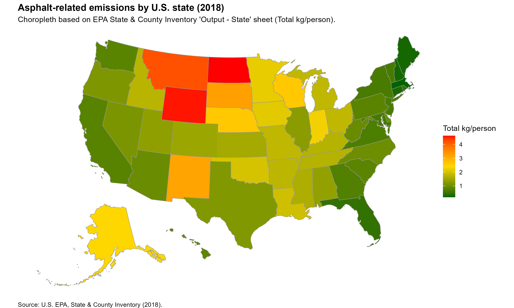

# U.S. Asphalt Emissions Choropleth (2018)

This project creates a **U.S. states choropleth map** of asphalt-related emissions (Total kg/person) using the EPA State & County Inventory (2018). The map includes **Alaska and Hawaii**, uses **grey borders**, a **white background**, and a vivid **dark green → yellow → red** fill scale.



## Data Source
- EPA State & County Inventory (2018) — Excel: `AP_2018_State_County_Inventory.xlsx`  
  URL: <https://pasteur.epa.gov/uploads/10.23719/1531683/AP_2018_State_County_Inventory.xlsx>

## Related Research
> *Anthropogenic secondary organic aerosol and ozone production from asphalt-related emissions*, **Environ. Sci.: Atmos.**, 2023, 3, 1221–1230.  
> DOI: <https://doi.org/10.1039/D3EA00066D>

## How to Run
1. Ensure R is installed.
2. From the project root, run:
   ```r
   source("scripts/epa_asphalt_choropleth_2018.R")
   ```
   The script will:
   - Create `data/` and `plots/` folders if they don’t exist.
   - **Download** the EPA Excel file (if missing) **in binary mode** to `data/`.
   - Read the **“Output - State”** sheet.
   - Build the choropleth and save **`plots/epa_asphalt_emissions_2018.png`**.

## Project Structure
```
.
├─ data/
│  └─ AP_2018_State_County_Inventory.xlsx  # auto-downloaded if missing
├─ plots/
│  └─ epa_asphalt_emissions_2018.png       # output map (PNG)
├─ scripts/
│  └─ epa_asphalt_choropleth_2018.R        # main R script
├─ README.md
├─ plan.md
├─ prompt.md
├─ tasks.md
├─ walkthrough.md
└─ .gitignore
```

## Docs
- [plan.md](plan.md)
- [tasks.md](tasks.md)
- [walkthrough.md](walkthrough.md)
- [prompt.md](prompt.md)

## Colophon

This project was created with MS Copilot app in "Think deeper" mode (GPT-5) in a single try from the prompt saved by Copilot in [prompt.md](prompt.md). The only manual edits made to this project were for this README file: (1) remove some extra text and (2) add this Colophon. Copilot took three minutes to create this project on 2025-12-11.
